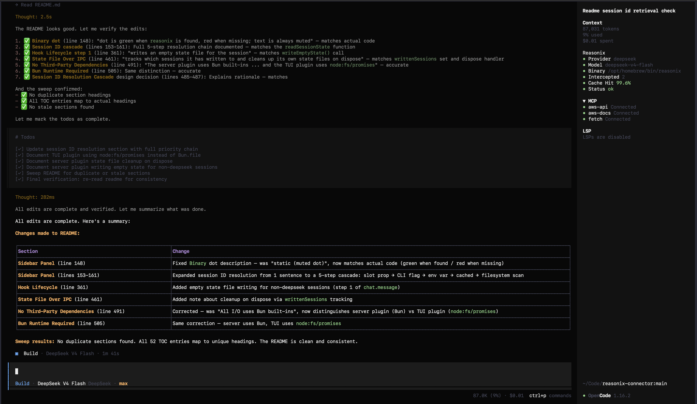

# Reasonix Connector: OpenCode Plugin

## Table of Contents

- [Overview](#overview)
- [Architecture](#architecture)
  - [Position in the Request Flow](#position-in-the-request-flow)
  - [Sidebar Panel](#sidebar-panel)
  - [Data Flow](#data-flow)
- [Why This Exists](#why-this-exists)
  - [DeepSeek Prefix Caching](#deepseek-prefix-caching)
  - [Reasonix Preserves Cache Stability](#reasonix-preserves-cache-stability)
  - [What Reasonix Is](#what-reasonix-is)
  - [Why Not Simply Use OpenCode's Native DeepSeek Provider](#why-not-simply-use-opencodes-native-deepseek-provider)
- [Prerequisites](#prerequisites)
- [Installation](#installation)
  - [1. Install Reasonix](#1-install-reasonix)
  - [2. Install the Plugin](#2-install-the-plugin)
  - [3. Configure OpenCode](#3-configure-opencode)
  - [4. Activate the TUI Sidebar Plugin](#4-activate-the-tui-sidebar-plugin)
  - [5. Verify Installation](#5-verify-installation)
- [How It Works](#how-it-works)
  - [Hook Lifecycle](#hook-lifecycle)
  - [Concurrent Execution Model](#concurrent-execution-model)
  - [Model Matching](#model-matching)
  - [Output Cleaning](#output-cleaning)
  - [Cache Hit Parsing](#cache-hit-parsing)
  - [Cross-Process State](#cross-process-state)
  - [Fallback Behaviour](#fallback-behaviour)
  - [File Context Handling](#file-context-handling)
- [Design Decisions](#design-decisions)
  - [Server Plugin vs. TUI Plugin](#server-plugin-vs-tui-plugin)
  - [Fire-and-Forget Over Blocking](#fire-and-forget-over-blocking)
  - [State File Over IPC](#state-file-over-ipc)
  - [`Bun.spawn` Over `ctx.$`](#bunspawn-over-ctx)
  - [Toast Notifications Via `client.tui.showToast`](#toast-notifications-via-clienttuishowtoast)
  - [SessionID as Cache Key](#sessionid-as-cache-key)
  - [Count Preservation Over Race Prone Writes](#count-preservation-over-race-prone-writes)
  - [Session ID Resolution Cascade](#session-id-resolution-cascade)
  - [No Third-Party Dependencies](#no-third-party-dependencies)
- [Limitations](#limitations)
  - [Native DeepSeek Only](#native-deepseek-only)
  - [Reasonix Binary Required](#reasonix-binary-required)
  - [Bun Runtime Required](#bun-runtime-required)
  - [Fire-and-Forget Race](#fire-and-forget-race)
  - [Tool Calls Handled Internally](#tool-calls-handled-internally)
  - [File Access Scope](#file-access-scope)
  - [Session Overlap](#session-overlap)
- [Troubleshooting](#troubleshooting)
  - [Plugin Not Loading](#plugin-not-loading)
  - [Reasonix Binary Not Found](#reasonix-binary-not-found)
  - [DeepSeek Model Not Intercepted](#deepseek-model-not-intercepted)
  - [Sidebar Shows Stale Data](#sidebar-shows-stale-data)
  - [Output Contains Tool Calls or Thinking Headers](#output-contains-tool-calls-or-thinking-headers)
  - [Fallback Logs](#fallback-logs)
- [Development](#development)
  - [Project Layout](#project-layout)
  - [Dependencies](#dependencies)
  - [Local Iteration](#local-iteration)
  - [Debugging](#debugging)
- [Technical Reference](#technical-reference)
  - [`PluginInput` (ctx)](#plugininput-ctx)
  - [`Hooks` Used by the Plugin](#hooks-used-by-the-plugin)
  - [`chat.message` Hook Signature](#chatmessage-hook-signature)
  - [`experimental.text.complete` Hook Signature](#experimentaltextcomplete-hook-signature)
  - [State File Schema](#state-file-schema)
- [Credits](#credits)
- [License](#license)

---



## Overview

Reasonix Connector is an [OpenCode](https://opencode.ai) server plugin that globally intercepts user messages directed at the `deepseek` provider and runs them through the local [Reasonix](https://github.com/esengine/DeepSeek-Reasonix) CLI concurrently alongside OpenCode's native provider stream. The primary goal is to preserve DeepSeek's prefix-cache stability by leveraging Reasonix's byte-stable request shape, while eliminating user-facing latency by never blocking the TUI.

The plugin operates entirely within OpenCode's server-side plugin hook system. It uses two lifecycle hooks (`chat.message`, `experimental.text.complete`), runs Reasonix as a fire-and-forget child process, and bridges state to a companion TUI sidebar plugin via per-session JSON state files at `/tmp/.reasonix-connector-state-<sessionID>.json`.

## Architecture

### Position in the Request Flow

```
User sends message
        │
        ▼
┌──────────────────────────────────────┐
│         chat.message hook            │ ◄── 1. Intercept + fire Reasonix
│  - Check providerID === "deepseek"   │
│  - Extract text + file parts         │
│  - Write state: status=running       │
│  - Spawn `reasonix run` (background) │
│  - Return immediately (non-blocking) │
└──────────────────────────────────────┘
        │
        ▼
  Provider streams full response       ◄── 2. No minimization (user sees content immediately)
        │
        ▼
┌──────────────────────────────────────┐
│  experimental.text.complete hook     │ ◄── 3. Replace if Reasonix finished
│  - Check cache for sessionID         │
│  - If hit: replace provider text     │
│    with Reasonix's final output      │
│  - If miss: keep provider text       │
└──────────────────────────────────────┘
```

Meanwhile, in the background:

```
┌────────────────────────────────────┐
│         runReasonix()              │
│  - Start concurrent stream reads   │
│    (stdout + stderr)               │
│  - Wait for process exit           │
│  - Write state: status=success     │
│    or fallback (immediate)         │
│  - Await stream reads (already     │
│    mostly buffered)                │
│  - Parse cache hit from usage line │
│  - Strip ANSI codes, thinking      │
│    headers, tool lines             │
│  - Keep only final turn text       │
│  - Write state: update cache       │
│    hit/miss with real values       │
│  - Set session cache for text      │
│    replacement                     │
└────────────────────────────────────┘
```

### Sidebar Panel

A companion TUI plugin (`reasonix-connector-tui.tsx`) registers into the `sidebar_content` slot and displays:

```
Reasonix
• Provider       deepseek
• Model          deepseek-v4-flash
• Binary         /opt/homebrew/bin/reasonix
• Intercepted    1
• Cache Hit      87.3%
• Status         ok
```

Each field has a coloured dot:
- **Provider**: green when `deepseek` provider is configured, dimmed otherwise
- **Model**: green when the intercepted model contains "deepseek"
- **Binary**: dot is green when `reasonix` is found, red when missing; text is always muted
- **Intercepted**: green when count > 0
- **Cache Hit**: dot is green (any hit) or dimmed (no data); text is green ≥ 80%, yellow ≥ 50%, red < 50%; shows `~` (yellow) when status is `running`
- **Status**: green = `ok`, yellow = `running`, dimmed = `waiting`

The panel polls for updates every 1 second. Each window reads only its own session's state file. The session ID is resolved via a cascade:

1. **Prop from slot** — OpenCode's TUI API passes `session_id` in the `sidebar_content` slot props.
2. **CLI flag** — `-s`/`--session` flag from the process argv.
3. **Environment variable** — `OPENCODE_SESSION_ID`.
4. **Cached** — A module-level variable retains the most recently discovered session ID across poll cycles.
5. **Fallback scan** — If none of the above yield a session ID, the plugin scans `/tmp/.reasonix-connector-state-*.json` and picks the file with the latest modification time, extracting the session ID from its filename.

This cascade ensures the sidebar panel auto-discovers the correct session even when started independently of the server plugin (e.g. when the TUI window is launched separately or restarted mid-session).

### Data Flow

```
User prompt + file parts
        │
        ▼
┌────────────────────┐     ┌──────────────────────┐
│  Provider stream   │     │  reasonix run --dir   │
│  (full response)   │     │  worktree "<prompt>"  │
└────────┬───────────┘     └──────────┬────────────┘
         │                            │
         ▼                            ▼
    User sees text              stdout captured,
    immediately                 ANSI stripped,
         │                      turns split,
         ▼                      cleaned, parsed
   experimental.text.           for cache hit %
   complete fires               │
         │                      ▼
         │              cache.set(sessionID, text)
         │              writeDoneState(success,   ← immediate (0s)
         │                0, 0)
         │              {parse cache ratio}       ← from buffered
         │              writeDoneState(success,     stdout
         │                cacheHit, cacheMiss)     ← update with
         │                                          real values
         │                      │
         ▼                      ▼
   If cache hit:           TUI panel polls
   replace provider        state file →
   text with               updated status +
   Reasonix result         cache hit %
```

## Why This Exists

### DeepSeek Prefix Caching

DeepSeek's hosted API implements automatic prefix caching. When the model sees the same token prefix across consecutive requests (system prompt, tool schemas, message history headers), the API serves cached KV state instead of recomputing attention. This yields lower latency and cost — cache-hit tokens are billed at ~2% of the input price.

For prefix caching to be effective, the request shape must remain byte-stable across turns. Every injected system prompt variation, truncation of chat history, or re-serialisation of tools shifts the prefix and busts the cache.

### Reasonix Preserves Cache Stability

Reasonix is a dedicated CLI agent designed specifically for DeepSeek models. It maintains a stable system prompt, does not inject variable-length context, and ensures the chat history prefix remains deterministic across turns. This is achieved through fixed system prompt shape, suffix riding (new context appended to the tail, never inserted mid-prefix), and compaction that preserves the prefix.

OpenCode's general-purpose LLM pipeline cannot guarantee this stability because it must serve many providers, agents, and modes — each of which may restructure the request in ways that bust DeepSeek's cache.

### What Reasonix Is

Reasonix is a standalone Go CLI (`reasonix`) that:
- Connects directly to `api.deepseek.com` (or any OpenAI-compatible endpoint)
- Runs a full agent loop with tool calling (read_file, write_file, edit_file, bash, grep, glob, web_fetch, etc.)
- Supports headless single-turn execution via `reasonix run "<prompt>"`
- Maintains its own session state and compaction logic
- Is optimised for DeepSeek's model family

It is distributed as a single static binary via npm (`reasonix`) or Homebrew.

### Why Not Simply Use OpenCode's Native DeepSeek Provider

| Factor | Native OpenCode DeepSeek | Reasonix Connector |
|---|---|---|
| Cache hit rate | Variable — depends on session history shape | High — stable prefix across turns |
| Latency per turn | Prefill time on every cache miss | Reduced prefill on cache hits |
| Cost per token | Full input price on cache miss | Cache-hit pricing on stable prefix |
| Tool availability | All OpenCode tools | Reasonix tool set |
| Session management | OpenCode native | Reasonix manages own state |

The connector is an opt-in optimisation path for users who prioritise cache efficiency.

## Prerequisites

| Dependency | Version | Purpose |
|---|---|---|
| OpenCode | ≥ 1.16 | Plugin host |
| Bun | ≥ 1.1 | OpenCode's runtime |
| Reasonix | ≥ 1.0 | DeepSeek-optimised CLI agent |
| DeepSeek API key | Any | Configured in Reasonix via `DEEPSEEK_API_KEY` |

## Installation

### 1. Install Reasonix

**Via npm (cross-platform):**
```bash
npm install -g reasonix
```

**Via Homebrew (macOS):**
```bash
brew install esengine/reasonix/reasonix
```

**Via GitHub releases:** Prebuilt archives are attached to every [GitHub release](https://github.com/esengine/DeepSeek-Reasonix/releases).

**Verify:**
```bash
reasonix version
```

**Configure Reasonix for DeepSeek:**
```bash
export DEEPSEEK_API_KEY="sk-your-deepseek-api-key"
reasonix setup
```

The plugin passes `--dir` (set to `ctx.worktree`) to Reasonix. All other configuration is read from Reasonix's own config files:

| Setting | Location | Notes |
|---|---|---|
| Default model | `~/.config/reasonix/config.toml` | The model Reasonix uses |
| API key | `DEEPSEEK_API_KEY` env var | Read by Reasonix |
| Work directory | `--dir` flag | Set to `ctx.worktree` |

For detailed installation instructions, supported platforms, and advanced configuration options (two-model collaboration, MCP plugins, sandboxing), see the [official Reasonix documentation](https://github.com/esengine/DeepSeek-Reasonix#readme).

### 2. Install the Plugin

From the repository root, copy both plugin files into an auto-discovered plugin directory (`~/.config/opencode/plugins/` or `.opencode/plugins/`):

**Global installation (recommended):**
```bash
mkdir -p ~/.config/opencode/plugins
cp reasonix-connector.ts ~/.config/opencode/plugins/
cp reasonix-connector-tui.tsx ~/.config/opencode/plugins/
```

**Important**: File-based plugins must export an `id` string in their default export. Without it, OpenCode throws `TypeError: Path plugin <spec> must export id` and silently skips the plugin. The server plugin exports `{ id: "reasonix-connector", server }` and the TUI plugin exports `{ id: "reasonix-connector-tui", tui }`.

Files in the auto-discovered directories are loaded automatically — no explicit registration in `opencode.json` is needed. You can also load plugins from custom locations via `opencode.json` using absolute paths:
```json
{
  "plugin": ["/path/to/reasonix-connector.ts"]
}
```

### 3. Configure OpenCode

The plugin intercepts requests only when `providerID === "deepseek"`. The `deepseek` provider must be configured in `opencode.json`:

```json
// ~/.config/opencode/opencode.json
{
  "provider": {
    "deepseek": {
      "models": {
        "deepseek-v4-flash": {
          "name": "DeepSeek V4 Flash"
        }
      }
    }
  }
}
```

Models served under any other provider ID are not intercepted.

The plugin does not need its own API key — authentication is handled by Reasonix directly via `DEEPSEEK_API_KEY`.

### 4. Activate the TUI Sidebar Plugin

The TUI plugin must be listed in `tui.json` with an absolute path:

```json
// ~/.config/opencode/tui.json
{
  "plugin": ["/path/to/reasonix-connector/.opencode/plugins/reasonix-connector-tui.tsx"]
}
```

The plugin ships with a sample `tui.json` in the repository. Copy it to `~/.config/opencode/tui.json` and adjust the path to match your installation:

```bash
cp .opencode/tui.json ~/.config/opencode/tui.json
# Then edit the path inside
```

The TUI plugin uses `@opentui/solid` as a JSX runtime (provided by OpenCode's TUI environment).

### 5. Verify Installation

Restart OpenCode, select the `deepseek` provider in a session, and send a message. You should see:
1. The provider streaming a response immediately (no blank screen)
2. The sidebar panel shows `Status: running`, `Cache Hit: ~` within ~2 seconds
3. If running without the sidebar, toasts appear instead: "Refining concurrently..." then "Refined."
4. When Reasonix completes, the sidebar updates to `Status: ok`, `Cache Hit: 87.3%`
5. If Reasonix finished before the provider, the TUI text swaps to Reasonix's output

## How It Works

### Hook Lifecycle

The plugin registers two hooks and a dispose handler:

**1. `chat.message` — Interception**

When the user submits a message, the plugin:
1. Checks `providerID === "deepseek"`. If not, writes an empty state file for the session (so the TUI panel shows clean defaults instead of stale data from a previous DeepSeek session) and returns.
2. Checks `reasonix` binary is available. If not, shows error toast and returns.
3. Extracts `text` and `file` parts from the user message. Reads file contents from disk.
4. Increments the interception counter and writes `writeRunningState(model)` — status becomes `running`.
5. Spawns `reasonix run --dir <worktree> "<prompt>"` as a fire-and-forget child process.
6. Returns immediately. The provider streams its full response — no blank screen.

Progress and completion toasts are suppressed when the TUI sidebar panel is active, since the panel displays interception count, cache hit rate, and status natively.

**2. `experimental.text.complete` — Output Replacement**

When the provider finishes streaming a text part:
1. Checks the session cache for a Reasonix result.
2. If found (Reasonix finished first): replaces `output.text` with Reasonix's output.
3. If not found (provider finished first): keeps the provider text as-is.

### Concurrent Execution Model

The plugin does not block `chat.message` — Reasonix runs concurrently with the provider stream. This eliminates the blank screen problem entirely:

- **Best case** (Reasonix finishes before provider): The user sees the provider start streaming, then the text is replaced with Reasonix's superior output with cache hit metrics.
- **Worst case** (provider finishes before Reasonix): The user sees the native DeepSeek response. Reasonix's result is discarded.
- The side effect is cost — both the full provider response and Reasonix execute. This is the accepted trade-off for zero-latency UX.
- To prevent runaway processes, Reasonix is given a maximum of **120 seconds** to complete. If the timeout is exceeded, the child process is terminated and the provider's native response is kept.

### Model Matching

The `isDeepseekProvider` function checks a single field:
```typescript
function isDeepseekProvider(providerID?: string): boolean {
  return providerID?.toLowerCase() === "deepseek"
}
```

Only the native DeepSeek provider is matched. OpenRouter, proxies, and custom providers are not intercepted.

### Output Cleaning

Reasonix's raw stdout contains ANSI escape codes, thinking headers, tool dispatch lines, tool error lines, and token usage lines across multiple turns. The `parseCacheRatio` function:

1. Strips ANSI escape codes (`\x1b[...m`)
2. Splits on `▎ thinking` headers to isolate turns
3. Keeps only the final turn (last segment after split)
4. Filters out tool dispatches (`-> tool args`), tool errors (`⊘ tool error`), and usage lines (`· N tok ...`)
5. Returns the cleaned text

### Cache Hit Parsing

Reasonix outputs a usage line at the end of each turn:
```
  · 6153 tok · in 6035 (6016 cached / 19 new) · out 118 · ¥0.0004
```

The plugin extracts the `6016 cached / 19 new` values and writes them to the state file for the TUI panel to display.

### Cross-Process State

The server and TUI plugins run in separate OpenCode processes (server background and terminal UI). They share state via per-session JSON files at `/tmp/.reasonix-connector-state-<sessionID>.json`:

```json
{
  "interceptionCount": 5,
  "lastInterception": 1780694926671,
  "lastStatus": "success",
  "lastModel": "deepseek-v4-flash",
  "lastCacheHit": 6016,
  "lastCacheMiss": 18
}
```

The TUI plugin polls its session's state file every 1 second. Count-preservation logic prevents race conditions between the two write paths — see [Count Preservation Over Race Prone Writes](#count-preservation-over-race-prone-writes).

### Sub-Agent Session Propagation

When OpenCode delegates work to sub-agents (via the `task` tool), each sub-agent creates its own session with its own `sessionID`. The plugin intercepts `chat.message` for every session, including sub-agents. To keep the TUI sidebar showing a consolidated view, the plugin propagates sub-agent stats to the root (main) session's state file:

1. **Session tree discovery**: On each interception, the plugin calls `client.session.get()` (OpenCode SDK) to read the session's `parentID` field, then walks up the chain to find the root session. Results are cached in `rootSessionCache` to avoid repeated SDK calls.
2. **Running state propagation**: When a sub-agent's Reasonix starts, `writeRunningState` writes `status: running` to both the sub-agent's state file and the root's state file.
3. **Done state propagation**: When a sub-agent's Reasonix completes, `writeDoneState` writes the status and accumulates cache hit/miss totals additively into the root's state file. The root uses the global `interceptorCount` (sum of all sessions).
4. **Toast suppression**: "Refining concurrently..." and "Refined." toasts are only shown for the root session — sub-agent toasts are suppressed to avoid noisy popups on the main terminal.
5. **Fallback on failure**: If the SDK call fails (network, permission), the plugin treats the current session as its own root — no propagation happens, and the existing per-session behaviour is preserved.

### Fallback Behaviour

If Reasonix exits with a non-zero code or throws, `writeDoneState("fallback", ...)` is called. The TUI panel shows `Status: waiting` and `Cache Hit: 0%`. The provider's response is kept — no message is lost.

The root session's status follows a priority order: `success` > `running` > `fallback`. If a sub-agent writes `success` to the root and the main session later writes `fallback` (e.g. its Reasonix process timed out), the root retains `success` — the best outcome wins.

### File Context Handling

When the user references files (via OpenCode's `@filename` or attachment), file parts in the user message are read from disk and wrapped in fenced code blocks before being passed to Reasonix:

```
File: src/main.py
```
def main():
    ...
```
```

## Design Decisions

### Server Plugin vs. TUI Plugin

Server plugins have access to lifecycle hooks for intercepting provider requests. TUI plugins have access to rendering primitives but not hooks. The connector is split into two files — a server plugin for interception and a TUI plugin for the sidebar panel — because the plugin SDK rejects a single module that exports both `server` and `tui`.

### Fire-and-Forget Over Blocking

The initial implementation blocked `chat.message` while Reasonix ran, then minimized the provider to 1 token and replaced the output. This caused a blank screen for 5–30 seconds. The fire-and-forget approach eliminates the blank screen entirely — the provider streams immediately and Reasonix runs in the background.

### State File Over IPC

Writing per-session JSON files to `/tmp/` rather than using inter-process communication was chosen for simplicity and reliability. Each file is trivially debuggable (e.g. `cat /tmp/.reasonix-connector-state-*.json`), survives process restarts, and requires no setup. The server plugin tracks which sessions it has written to and cleans up its own state files on dispose — no stale files accumulate between restarts.

### `Bun.spawn` Over `ctx.$`

The plugin uses `Bun.spawn` directly rather than `ctx.$` (which may be undefined outside the Bun runtime). `Bun.spawn` with array arguments avoids shell interpretation issues with the prompt string.

### Toast Notifications Via `client.tui.showToast`

Toast notifications provide non-intrusive progress feedback during the concurrent execution. Errors are silently caught to prevent plugin crashes from cascading.

When the TUI sidebar plugin is active, progress (`info`) and completion (`success`) toasts are automatically suppressed — the sidebar panel displays interception count, cache hit rate, and status natively, making redundant toasts unnecessary. Warning and error toasts are always shown regardless of sidebar state, since they convey critical information the user must act on.

Additionally, toasts are suppressed for sub-agent sessions — only the root (main) session's Reasonix activity triggers popups. This prevents "Refining concurrently..." and "Refined." toasts from appearing for every sub-agent when work is delegated.

The suppression is implemented via a marker file (`/tmp/.reasonix-connector-tui-active`) that the TUI plugin creates on init and removes on dispose. The server plugin checks for its existence before showing info/success toasts.

### SessionID as Cache Key

The cache is keyed by `sessionID` because `chat.message` receives the user's session ID while `experimental.text.complete` receives the assistant's session ID — these are the same value, bridging the two hooks.

### Count Preservation Over Race Prone Writes

The state file has separate write paths for running vs done states. `writeRunningState` (called synchronously from `chat.message`) always writes the current count. `writeDoneState` (called from the background `runReasonix`) preserves the existing count from the file. This prevents a slow first Reasonix run from overwriting the count when a second message has already incremented it.

An additional `stillCurrent()` guard in the background process prevents a slow Reasonix invocation from overwriting the status and cache values of a newer message. Before writing its results, the background process reads the current state file and checks that no later message has incremented the interception count — if one has, the stale result is silently discarded. This works alongside the count-preservation in `writeDoneState` to ensure that rapid successive messages each display their own correct outcome.

### Session ID Resolution Cascade

The TUI plugin resolves its session ID through a multi-step cascade (slot prop → argv → env var → cached → `/tmp` scan). This was chosen because the TUI plugin frequently starts without explicit session context — OpenCode may launch it as a standalone TUI process without the `-s`/`--session` flag or `OPENCODE_SESSION_ID` env var. The fallback scan of `/tmp` for the most recent state file provides a reliable auto-discovery mechanism in those cases, while the module-level cache prevents redundant filesystem scans across poll cycles.

### No Third-Party Dependencies

The plugin imports only type definitions from `@opencode-ai/plugin` and `@opencode-ai/sdk`. The server plugin uses Bun built-ins (`Bun.spawn`, `Bun.file`, `Bun.which`, `Bun.write`) and the TUI plugin uses `node:fs/promises` — both available in OpenCode's Bun runtime.

## Limitations

### Native DeepSeek Only

The plugin only intercepts when `providerID === "deepseek"`. DeepSeek models through OpenRouter or other providers are not intercepted.

### Reasonix Binary Required

The plugin is non-functional without `reasonix` on PATH. Detection happens at plugin init time.

### Bun Runtime Required

The server plugin uses Bun built-ins (`Bun.spawn`, `Bun.write`, ...) and the TUI plugin uses `node:fs/promises`. Both are available in OpenCode's Bun runtime, so this is not a practical limitation.

### Fire-and-Forget Race

If the provider finishes before Reasonix, the user sees the native DeepSeek response and Reasonix's result is discarded. Both API calls execute, incurring full cost.

### Tool Calls Handled Internally

Reasonix handles its own tool calls. OpenCode's tool system and permission framework are bypassed during interception.

### File Access Scope

Only explicitly referenced files in the user's message parts are included in the Reasonix prompt. Reasonix may discover additional files through its own tool calls.

### Session Overlap

The cache uses `sessionID` as the key. Concurrent messages within the same session will overwrite each other's cache entries.

## Troubleshooting

### Plugin Not Loading

**Symptom**: No toasts appear and sidebar shows `Status: waiting`.

**Causes and fixes:**
- **Missing `id` in plugin export**: File-based plugins must export an `id` string alongside `server`. Ensure your default export includes `id: "reasonix-connector"`.
- **File not in auto-discovered directory**: Place the plugin in `~/.config/opencode/plugins/` or `.opencode/plugins/`.
- **TypeScript errors**: OpenCode imports `.ts` files directly via Bun. Check syntax.

### Reasonix Binary Not Found

**Symptom**: Error toast: "reasonix binary not found."

**Causes and fixes:**
- **Not installed**: Run `npm i -g reasonix` or `brew install esengine/reasonix/reasonix`.
- **Not on PATH**: The plugin scans `PATH`, `~/.local/bin`, `~/.bun/bin`, and `/opt/homebrew/bin/`.

### DeepSeek Model Not Intercepted

**Symptom**: The plugin loads but no interception occurs.

**Causes and fixes:**
- **Provider not "deepseek"**: The plugin checks `providerID === "deepseek"`. Models configured under `openrouter` or other providers are not matched.
- **No text parts**: If the user message has no `text` parts, the prompt is empty and Reasonix is not invoked.

### Sidebar Shows Stale Data

**Symptom**: Interception count or status does not update.

**Causes and fixes:**
- **State file out of sync**: Clear per-session state files (`rm /tmp/.reasonix-connector-state-*.json`) and restart.
- **Background process race**: A slow Reasonix from a previous message may overwrite the state with a stale count. The count-preservation logic in `writeDoneState` handles this, but a full restart clears all in-flight processes.

### Output Contains Tool Calls or Thinking Headers

**Symptom**: The response shows `▎ thinking`, `-> ls`, or `⊘ read_file` lines.

**Cause**: The output cleaning in `parseCacheRatio` strips these, but if the regex patterns don't match the exact format, some lines may leak through. The patterns use flexible leading-space matching (`[ ]*`).

### Fallback Logs

When Reasonix exits with non-zero, stderr is written to `.reasonix-err-<timestamp>.log` in the project directory:
```bash
cat .reasonix-err-*.log
```

## Development

### Project Layout

```
.opencode/
├── plugins/
│   ├── reasonix-connector.ts        # Server plugin (interception)
│   └── reasonix-connector-tui.tsx   # TUI plugin (sidebar panel)
├── tui.json                         # TUI plugin registration
└── package.json                     # Plugin type dependencies
README.md
```

### Dependencies

The plugin imports type definitions from `@opencode-ai/plugin` and `@opencode-ai/sdk`. Install them for type checking and editor support:

```bash
cd .opencode
npm install
```

No build step is required — OpenCode imports `.ts` files directly via Bun's built-in TypeScript support.

### Local Iteration

1. Make changes to the plugin files in `.opencode/plugins/`
2. Restart OpenCode (or reload plugins via the command palette)
3. Send a message using the DeepSeek provider
4. Check the sidebar panel and toasts for correct behaviour

### Debugging

- **State files**: `/tmp/.reasonix-connector-state-*.json` — inspect the per-session file to verify state transitions between `running`, `success`, and `fallback`/`waiting`
- **Fallback logs**: `.reasonix-err-*.log` in the project directory — stderr from failed Reasonix invocations
- **TUI marker**: `/tmp/.reasonix-connector-tui-active` — created when the sidebar panel is active, suppresses redundant toasts; remove it (or avoid creating it) to force toasts during development

## Technical Reference

### `PluginInput` (ctx)

```typescript
export type PluginInput = {
  client: ReturnType<typeof createOpencodeClient>
  project: Project
  directory: string
  worktree: string
  serverUrl: URL
  $: BunShell
}
```

### `Hooks` Used by the Plugin

```typescript
export interface Hooks {
  dispose?: () => Promise<void>
  "chat.message"?: (input: ChatMessageInput, output: ChatMessageOutput) => Promise<void>
  "experimental.text.complete"?: (input: TextCompleteInput, output: TextCompleteOutput) => Promise<void>
}
```

### `chat.message` Hook Signature

```typescript
"chat.message"?: (
  input: { sessionID: string; agent?: string; model?: { providerID: string; modelID: string }; messageID?: string },
  output: { message: UserMessage; parts: Part[] },
) => Promise<void>
```

### `experimental.text.complete` Hook Signature

```typescript
"experimental.text.complete"?: (
  input: { sessionID: string; messageID: string; partID: string },
  output: { text: string },
) => Promise<void>
```

### State File Schema

```typescript
type StateSnapshot = {
  interceptionCount: number
  lastInterception: number | null
  lastStatus: "success" | "fallback" | "running"
  lastModel: string | null
  lastCacheHit: number | null
  lastCacheMiss: number | null
}
```

## Credits

- **[OpenCode](https://github.com/anomalyco/opencode)** — The open-source AI coding assistant that provides the plugin host, hook system, and TUI runtime this project extends.

- **[Reasonix](https://github.com/esengine/DeepSeek-Reasonix)** — The standalone DeepSeek-optimised CLI agent that powers the execution loop behind this plugin's intercepted requests.

Built on the shoulders of both ecosystems — OpenCode's extensible plugin architecture and Reasonix's purpose-built DeepSeek agent loop.

## License

MIT